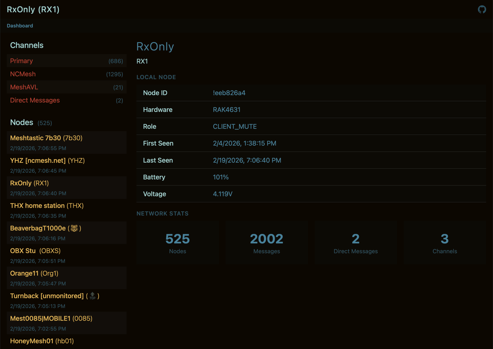
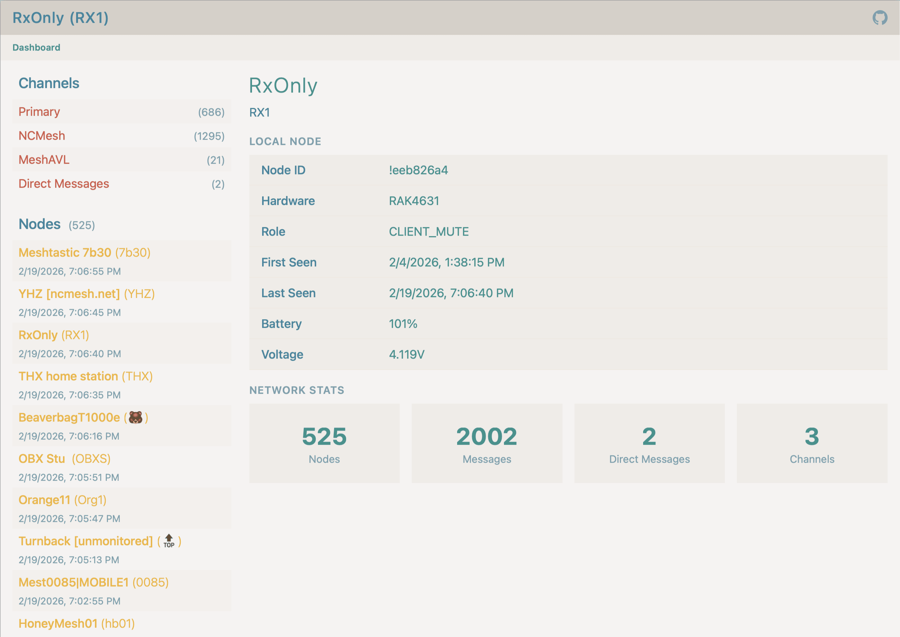
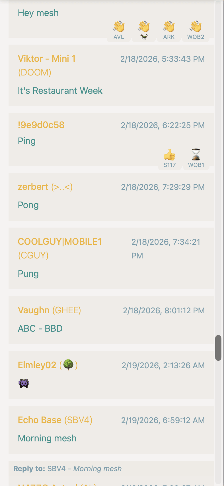

# RxOnly

**A secure, read-only web interface for monitoring [Meshtastic](https://meshtastic.org/) nodes and messages.**


<!-- TODO(seam): README.md:6 described the collector and the web app as two parts of one
     project. RxOnly is now just the web app, and reads a database produced by Mesh
     Collector — which has to be set up first. -->

The application is intended to be lightweight, low-dependency, and security focused. All interaction with the Meshtastic device happens through a controlled backend process, and the web layer is strictly read-only. The goal is observability, not control.

That separation is now enforced by what is installed, not only by how the code is written. The Meshtastic libraries are dependencies of [Mesh Collector](https://github.com/epohs/mesh-collector) and not of RxOnly, so the internet-facing process has no library in its import path capable of driving a radio. It opens the database Mesh Collector writes, read-only, and does nothing else.

This project is built for personal use and experimentation, prioritizing clarity, safety, and ease of maintenance over features.

> [!IMPORTANT]
>
> While I’ve made a conscious effort to keep this project as secure as possible, there is still real risk involved in exposing any service on a home network to the public internet.
>
> If you deploy RxOnly in a way that makes it publicly accessible, you will almost certainly be exposing your home IP address, and you are responsible for understanding and accepting the security implications of doing so. This project is provided as a read-only dashboard, but that does not eliminate the broader risks that come with running publicly reachable services.
>
> If you’re not comfortable thinking through things like network exposure, reverse proxies, SSH hardening, firewall rules, and access control, you should take the time to understand them before deploying this publicly.

> **ALSO:** Do not expose private channels or DMs that are assumed to be private to the public internet. That’s not cool, and it is **not** what this project is intended for. Private channels are private for a reason.

<!-- TODO(seam): the warning above covers publishing DMs, which is this project's
     decision. The matching "should the archive store them at all" warning moved to
     Mesh Collector. -->

| | | |
|:--:|:--:|:--:|
| [](rxonly/web/static/img/screenshot-01.png) | [](rxonly/web/static/img/screenshot-02.png) | [](rxonly/web/static/img/screenshot-03.png) |
| <sub>Dashboard in dark mode</sub> | <sub>Dashboard in light mode</sub> | <sub>Messages with tapbacks</sub> |

## Installation & Getting Started

This project uses [uv](https://docs.astral.sh/uv/) for Python dependency management and virtual environments.

### Prerequisites
- Python 3.10 or newer
- `uv` installed globally
- A working [Mesh Collector](https://github.com/epohs/mesh-collector) install (RxOnly reads its database and cannot collect data on its own)

### Clone the repository

```
git clone https://github.com/epohs/RxOnly.git
cd RxOnly
```

### Create the virtual environment


Each project in this suite uses its own virtual environment.

```
# Create environment
uv init
# Install dependencies
uv sync
```

### Customize your `rxonly/config.json` file

Copy the [`rxonly/config-sample.json`](/rxonly/config-sample.json) file and create a new `config.json` file. I think the values are fairly self-explanatory with one exception.

<!-- TODO(seam): the exception used to be SERIAL_PORT (README.md:61-65), which moved to
     Mesh Collector. For RxOnly the one that needs explaining is DB_PATH — it has to point
     at the database Mesh Collector writes, and RxOnly opens it read-only. -->

Setting `DEBUG` to true will disable compression of the site by [Flask-Compress](https://pypi.org/project/Flask-Compress/), and will serve the unminified CSS and JS files, as well as writing more verbose logs.

All config options are documented in [`config.py`](/rxonly/config.py).

RxOnly's settings cover how the archive is presented. What gets collected and how much of it is kept are Mesh Collector's settings, and RxOnly reads those as facts from the database rather than keeping its own copy — so a retention limit only has to be changed in one place.

Any option can also be set from the environment, prefixed so that co-hosted projects don't share a namespace: RxOnly reads `RXONLY_DB_PATH`, Mesh Collector reads `MESH_COLLECTOR_SERIAL_PORT`, and so on. Environment variables win over `config.json`.


### Running the Web App (Flask)

The Flask application exposes a private JSON API and serves a small frontend.

```
source .venv/bin/activate
flask --app rxonly.web run
```

The app will be available at:

```http://127.0.0.1:5000```


## One Real Use Case

I use this project to see what’s going on with the Meshtastic network back home while I am traveling. Also, I find it a little quicker to visit a webpage than to open the Meshtastic app, so I even use it at home.

<!-- TODO(seam): README.md:107 said this project provides "the collector script and the
     read-only web dashboard" — now just the dashboard, and the deploy directory here
     holds only the web-tier examples. -->

<!-- TODO(seam): README.md:109-111 set the scene on the Raspberry Pi and described two
     systemd services. The Pi and device details are Mesh Collector's now; what belongs
     here is the gunicorn service and the fact that it reads the collector's database. -->

In front of the Flask app, I use [nginx](https://nginx.org/) as a reverse proxy. Nginx handles incoming HTTP(S) requests, terminates TLS, and forwards traffic to the Flask application running on localhost. SSL certificates are managed and automatically renewed using [Let’s Encrypt](https://letsencrypt.org/).

Because this is running on a home network where the public IP address can change, I also run a small script periodically via `cron` that uses the [Cloudflare DNS API](https://developers.cloudflare.com/api/resources/dns/subresources/records/methods/update/) to update a subdomain on a domain that I own. This ensures the subdomain always points to the Raspberry Pi, even if my ISP changes my IP address.


## A Hypothetical Use Case

This project could be set up and made public with the intention of creating a mesh-based community bulletin board.

Imagine a handful of custom channels created around specific discussion topics (think old-school web forums). The dashboard becomes a simple, read-only window into those conversations, visible to anyone on the web. If someone wants to participate, there’s no account to create and no app to install — all they need is a working Meshtastic node and to be within range.

It’s a low-friction way to surface local mesh-native conversations to a wider audience, while keeping participation grounded in the mesh itself.


## API Endpoints

- `GET /api/stats` - Dashboard statistics and local node info
- `GET /api/nodes` - List all nodes (supports `?limit`, `?offset`, `?search`)
- `GET /api/nodes/<node_id>` - Single node details
- `GET /api/channels` - List tracked channels
- `GET /api/messages` - Channel messages (supports `?channel_index`, `?limit`, `?after_rx_time`, `?before_rx_time`, `?newest`)
- `GET /api/messages/<message_id>` - Single message details
- `GET /api/direct-messages` - Direct messages received by local node
- `GET /api/direct-messages/<message_id>` - Single DM details


## Helpful commands

- `journalctl -u rxonly-www -f` View the logs output by the Flask/Gunicorn process.

- `sudo systemctl restart rxonly-www` Restart the Flask application.


## To-Do

1. Add mapping (Probably later).

2. Stop polling when nobody's looking. `views.js` starts the fast (10s) and slow (20s) timers on load and never clears them, so a backgrounded tab keeps hitting `/api/stats` and `/api/nodes` forever — one forgotten tab was doing ~340 requests/hour against the Pi. Add a `visibilitychange` handler: clear both timers on hide, restart them on show with one immediate poll to catch up.

3. Drop `indent=2` from the API responses. `/api/nodes?limit=50` goes out as 28 KB where compact is 20 KB. Brotli hides it on the wire, but the Pi still serializes and then compresses the extra bytes for nothing. Keep the pretty-printing behind `DEBUG` if it's worth having at all.

4. No logrotate for `gunicorn.access.log` — 28 MB and growing since February, a line per poll, and nginx already logs the same requests. Either ship a logrotate config in `deploy/` or turn gunicorn's access log off and let nginx be the record.


Licensed under the GNU AGPL-3.0
Copyright (c) 2026 epohs
